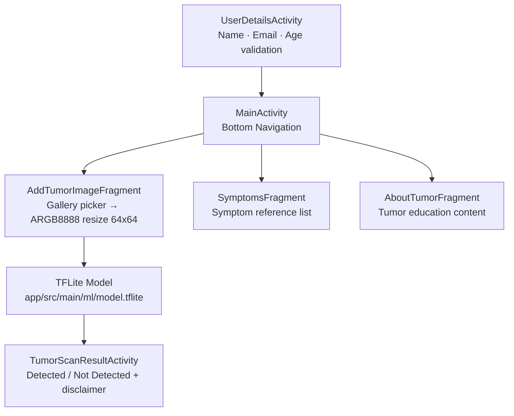

# 🧠 Unomed — On-device brain tumor detection for Android

Unomed is an Android app that lets a user upload a brain MRI scan and get an instant tumor-detection result — entirely offline, no server calls, no API key. Built for medical accessibility: the model is bundled in the APK and runs on any Android device (API 21+) including those without reliable internet.

---

## What it does

- Collects basic user details (name, email, age) with validation before any scan begins
- Accepts a brain MRI image from the device gallery via Android’s native image picker
- Runs the image through an on-device TFLite model and returns one of two results: “Brain Tumor Detected” or “No Brain Tumor Detected,” each with a clinical disclaimer
- Displays a reference list of 10 common brain tumor symptoms for user awareness
- Provides an informational About Tumors tab with educational content

## Why it’s interesting

- Fully offline inference — `model.tflite` is bundled in the APK via Android ML Model Binding (`buildFeatures { mlModelBinding = true }`). There is no network permission required; the model runs in `AddTumorImageFragment` using TensorFlow Lite 2.12.0 with no external API calls.
- Bitmap pre-processing pipeline in-app — the fragment converts any uploaded image to ARGB_8888, resizes to 64×64, and passes it through `TensorBuffer` directly, handling both legacy (`MediaStore`) and modern (`ImageDecoder`, API 28+) image loading paths.
- Consent-first UX — `UserDetailsActivity` validates name, email, and age before granting access to the scan screen, a deliberate pattern for health-adjacent apps.
- Single-activity architecture with a bottom navigation view routing three independent fragments (`AddTumorImageFragment`, `SymptomsFragment`, `AboutTumorFragment`), each lifecycle-isolated.

## Architecture



`UserDetailsActivity` gates entry. `MainActivity` hosts the bottom nav and fragment container. Inference runs inside `AddTumorImageFragment` via the ML Model Binding-generated `Model` class; results are passed via Intent to `TumorScanResultActivity`.

## Tech Stack


## Setup

```bash
git clone https://github.com/Munazil1/medical_image_analysis-app.git
cd medical_image_analysis-app
```

Open the project in **Android Studio Hedgehog or later** (File → Open → select the root folder).

Sync Gradle — dependencies download automatically:

- `org.tensorflow:tensorflow-lite:2.12.0`
- `org.tensorflow:tensorflow-lite-support:0.4.0`
- `com.makeramen:roundedimageview:2.3.0`

Build and run on a physical device or emulator (API 21+):

```
Run → Run ‘app’   (or Shift+F10)
```

No environment variables or API keys required. The TFLite model is already bundled at `app/src/main/ml/model.tflite`.

## Screenshots

Screenshots and demo recording coming soon — request a walkthrough via email.

## Future Work

- Upgrade the model input resolution beyond 64×64 — the current resize is a known accuracy bottleneck; a 224×224 MobileNetV2 backbone would improve sensitivity on low-contrast MRI regions
- Add a confidence score display alongside the binary result so users understand prediction certainty
- Support DICOM file input in addition to gallery images, enabling use with actual hospital imaging exports

## License

MIT — see [LICENSE](LICENSE).

---

Contact: [munazilv1@gmail.com](mailto:munazilv1@gmail.com) · [LinkedIn](https://www.linkedin.com/in/munazil-v-a9643a316/) · [Portfolio](https://github.com/Munazil1)

*Built with Mohammed Azif.*
